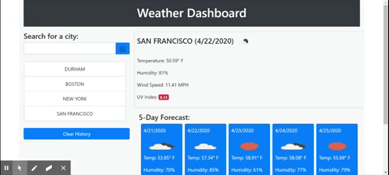

# weather-dashboard

# Purpose
As a traveler, I want to see the weather outlook for multiple cities so that I can plan a trip accordingly.  This app allows you to search a specific city for a 5-day forcast.  The results are saved in local storage so that when you return the previous 5 searched cities are displayed for you to simply click and view.

# Technology
This app uses the JQuery library to make an Ajax call to the weather api using the city input by the user.

# Here's a look at the app

## Installation
1. Fork the respository
1. Use git clone from the CLI to clone the remote repository

